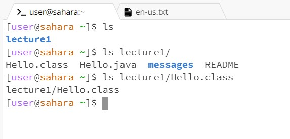
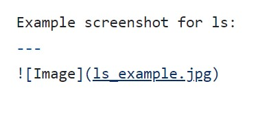
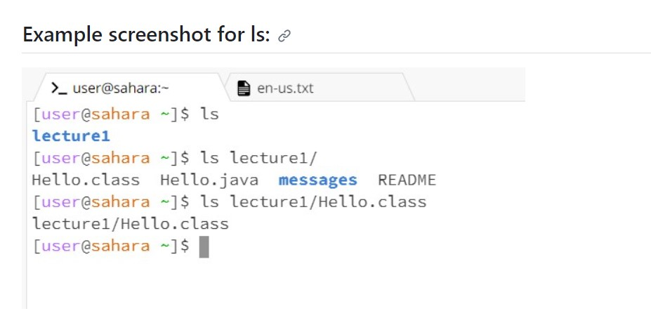
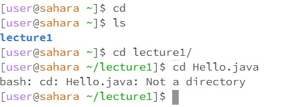
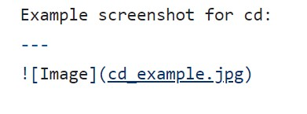
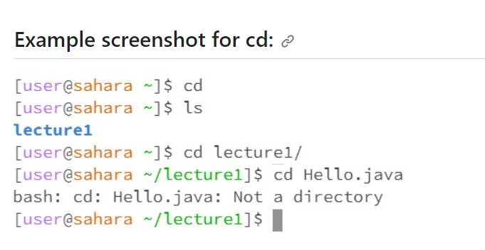
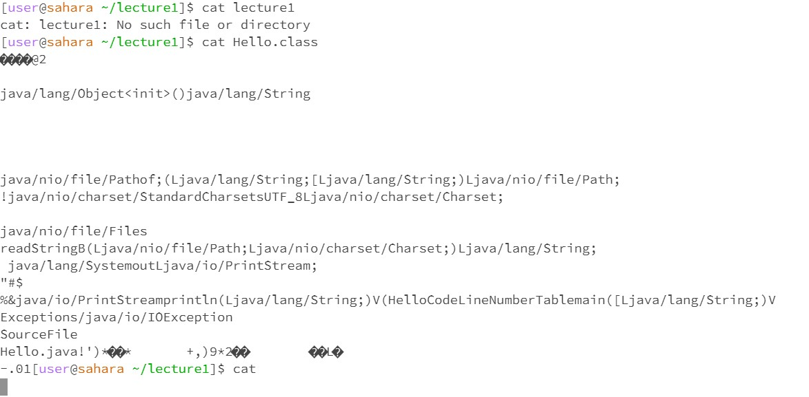
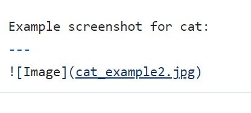
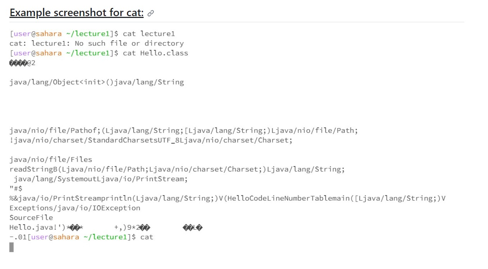

# Lab Report 1

***ls:***
ls Lecture1 worked as Lecture1 is a directory and it listed the paths that you could take from Lecture1.
When there's no argument, it'll show wherever you are as it'll list out your paths. 

Example screenshot for ls:
---

Code block
---

Output
---

Example screenshot for cd:
---

Code block
---

Output
---

Example screenshot for cat:
---

Code block
---

Output
---

